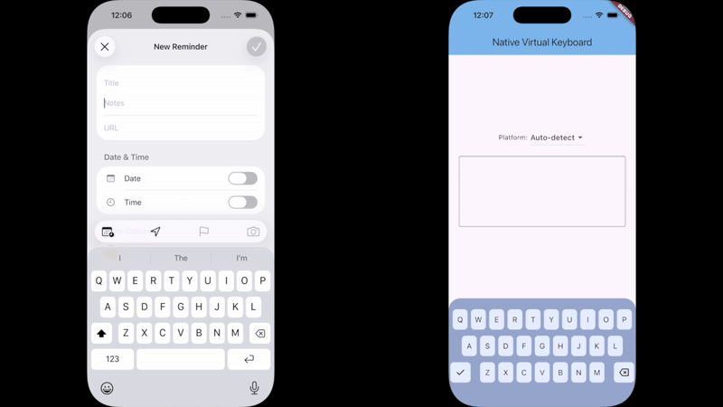

# native_virtual_keyboard

An almost pixel perfect Flutter replica of iOS and Android native keyboards.

## Showcase

The original iOS 26 (Liquid Glass) keyboard on the left, the Flutter replica is on the right.

## Getting Started

Please see example project. This plugin has no native dependencies and can be used on any platform.

## Author

This plugin is developed by [Chunky Tofu Studios](https://chunkytofustudios.com).

You can support us by checking out our apps!

For commercial support please reach out to hello@chunkytofustudios.com.
