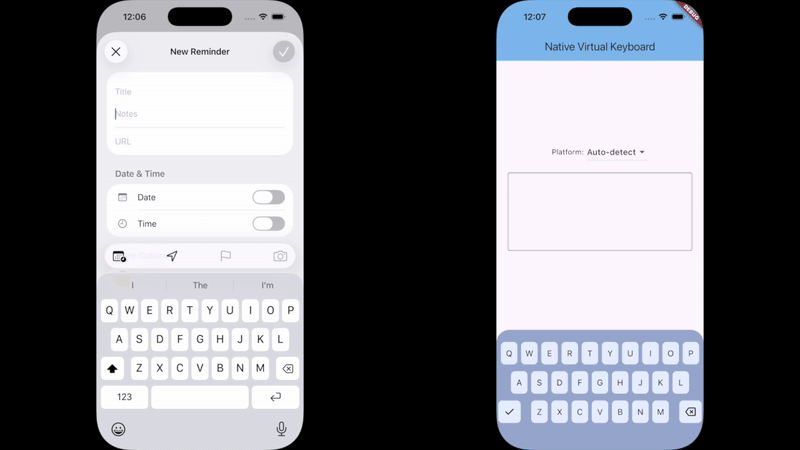

# native_virtual_keyboard

An almost pixel perfect Flutter replica of iOS and Android native keyboards.

## Showcase

The original iOS 26 (Liquid Glass) keyboard on the left, the Flutter replica is on the right.



## Features

*   **Native Appearance:** Ships with pixel-perfect designs for:
    *   Android
    *   iOS 18 (Classic)
    *   iOS 26 (Liquid Glass)
*   **Automatic Detection:** Automatically selects the correct keyboard style based on the platform.
*   **Theming API:** Powerful theming system to customize colors, shadows, and fonts.
*   **Disabled Keys:** Ability to disable specific keys (visually dimmed and non-interactive).
*   **Native Behavior:** Key tap animations, overlays, and sound effects matching native behavior.

## Usage

### Basic

The widget automatically detects the platform and renders the appropriate native keyboard.

```dart
VirtualKeyboard(
  controller: VirtualKeyboardController(
    layout: EnglishQwertyKeyboardLayout(),
    onKeyPress: (key) {
      // Handle key press
    },
  ),
),
```

### Custom Theme

You can fully customize the keyboard appearance using `KeyboardTheme`.

```dart
VirtualKeyboard(
  // Use a pre-built native theme
  theme: KeyboardTheme.androidDark(), 
  
  controller: ...,
),
```

Or create a completely custom theme:

```dart
VirtualKeyboard(
  theme: KeyboardTheme(
    backgroundColor: Color(0xFF1E3167),
    keyTheme: KeyboardKeyTheme(
      backgroundColor: Color(0xFF526087),
      pressedBackgroundColor: Color(0xFF4164C8),
      foregroundColor: Colors.white,
      shadows: [
        BoxShadow(offset: Offset(0, 1), color: Colors.black26),
      ],
    ),
    specialKeyTheme: KeyboardSpecialKeyTheme(
      backgroundColor: Color(0xFF4164C8),
      // ... special key properties
    ),
  ),
  controller: ...,
),
```

### Disabled Keys

Disable specific keys to make them visually dimmed and non-interactive:

```dart
VirtualKeyboard(
  disabledKeys: {'A', 'B', 'C'}, // Case-insensitive
  controller: ...,
),
```

Optionally customize disabled key appearance via theme:

```dart
KeyboardKeyTheme(
  // ... required colors
  disabledBackgroundColor: Colors.grey.shade300,
  disabledForegroundColor: Colors.grey.shade500,
)

## Getting Started

Please see the example project for a complete implementation. This plugin has no native dependencies and can be used on any platform.

## Author

This plugin is developed by [Chunky Tofu Studios](https://chunkytofustudios.com).

You can support us by checking out our apps!

For commercial support please reach out to hello@chunkytofustudios.com.